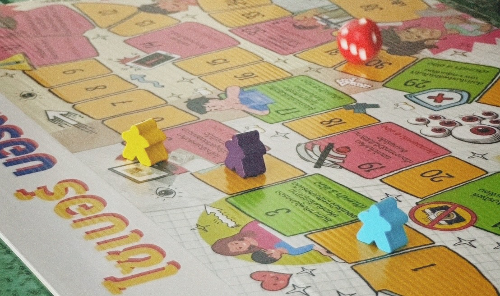

#  🤖 NCSA Boardgame with Seven Group 7️⃣
### >>>>>> มาร่วมสนุกไปพร้อมเกร็ดความรู้ในโลกไซเบอร์ และข้อควรระวังเป็นข้อคิด !

#### กิจกรรม Cyber Board Game เป็นกิจกรรมที่นำความรู้ แนวคิดเกี่ยวกับด้านความปลอดภัยไซเบอร์ มาประยุกต์ใช้ในรูปแบบเกมกระดาน มีการออกแบบเนื้อหา เช่น ธีมเกม กฎ กติกา และสถานการณ์สมมติที่เกี่ยวข้องกับภัยคุกคามไซเบอร์ เพื่อสร้างความเข้าใจง่ายในเนื้อหาความรู้ และความสนุกสนานในการเล่นเกม