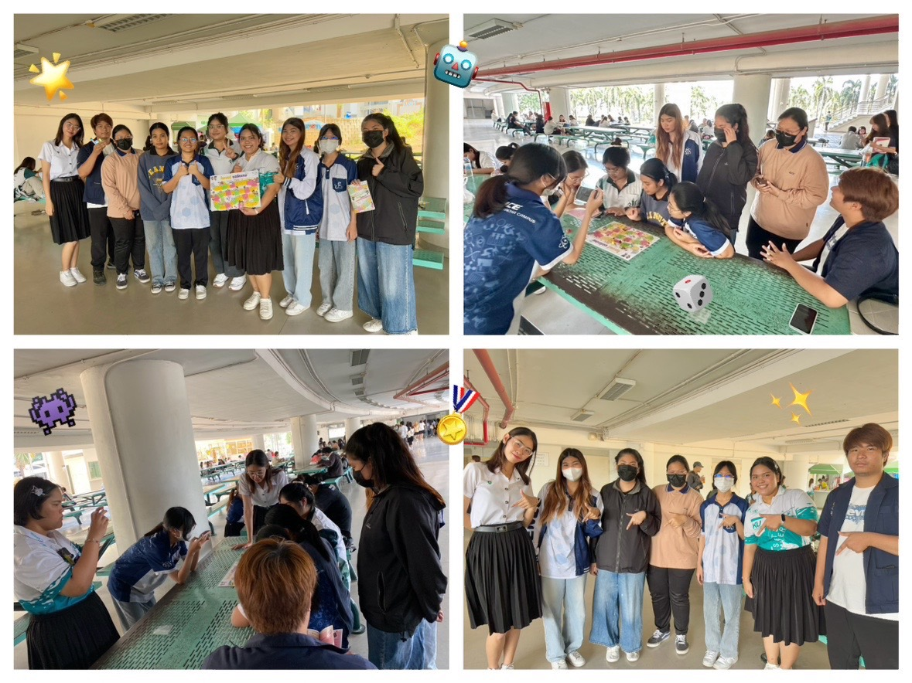

#  🤖 NCSA Boardgame with Seven Group 7️⃣
### >>>>>> มาร่วมสนุกไปพร้อมเกร็ดความรู้ในโลกไซเบอร์ และข้อควรระวังเป็นข้อคิด ❗

#### กิจกรรม Cyber Board Game 🧩
- เป็นกิจกรรมที่นำความรู้ แนวคิดเกี่ยวกับด้านความปลอดภัยไซเบอร์ มาประยุกต์ใช้ในรูปแบบเกมกระดาน มีการออกแบบเนื้อหา เช่น ธีมเกม กฎ กติกา และสถานการณ์สมมติที่เกี่ยวข้องกับภัยคุกคามไซเบอร์ เพื่อสร้างความเข้าใจง่ายในเนื้อหาความรู้ และความสนุกสนานในการเล่นเกม

### ข้อมูลกิจกรรม 📑
- สถานที่ : อาคาร 17 ศูนย์เรียนรวม 3
- จำนวนผู้เข้าร่วม : 3 คน 
- ช่วงเวลา : 12.30 - 13.00 น.

### วิธีเล่น 🎲
- นำตัวผู้เล่นมาที่จุดเริ่มต้นและผลัดกันทอยลูกเต๋าผู้เล่นที่ได้แต้มมากสุด จะเป็นผู้เล่นก่อนตามลำดับคะแนน
- ผู้เล่นผลัดกันทอยลูกเต๋า และเดินตามกระดานเท่ากับแต้มที่ได้ หากผู้เล่นเดินตกไปยังช่องพิเศษ ให้ผู้เล่นปฏิบัติตามคำสั่งเท่านั้น
- ผู้ที่มาถึงเส้นชัยก่อนคือผู้ชนะ 🏅

### ภาพ/วิดีโอ กิจกรรม 🎞️

[👉 Click to watch the video 📽️](https://drive.google.com/file/d/1swEFVGy7NZIjdUpkvj9tQjwjgMvlxWBd/view?usp=sharing)

---

### สรุปกิจกรรม : ความรู้และการป้องกันภัยคุกคามไซเบอร์ 🔏
- **การคิดวิเคราะห์**
    - ผู้ทำกิจกรรมและผู้เข้าร่วมกิจกรรม ได้ร่วมกันคิดวิเคราะห์สถานการณ์ พูดคุยเกี่ยวกับปัญหาภัยคุกคามไซเบอร์ และแนะนำแนวทางการป้องกัน แก้ไขปัญหา